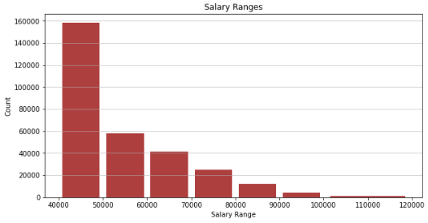
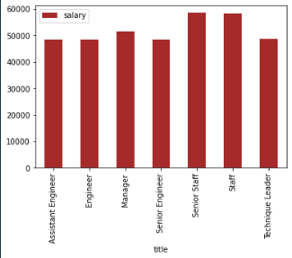

# Data Analysis and Visualization of Employee Salaries

This project analyzes and visualizes employee salary data, which is suspected to be fake. The analysis uses Pandas, SQLAlchemy, and Matplotlib to process the data and generate visualizations, aiming to present evidence to the boss about the data's authenticity.

## Requirements

- Python 3.6 or higher
- Pandas
- SQLAlchemy
- Matplotlib
- PostgreSQL database with employee data (see `EmployeeSQL_quiries.sql` and `EmployeeSQL_tables.sql` for SQL code)

## Installation

1. Ensure you have Python 3.6 or higher installed on your machine.
2. Install the required libraries using pip

## Usage

1. Clone the repository or copy the provided code into a Jupyter Notebook or Python script.
2. Replace `<password>` and `<my SQL Database>` with the appropriate values for your PostgreSQL database connection string.
3. Run the Jupyter Notebook cells or Python script in order.

## Results

The script generates two visualizations:

1. A histogram of the most common salary ranges for employees.

   
2. A bar chart of the average salary by employee title.

   

## Conclusion

Based on the visualizations, it appears that the dataset might be fake or compromised, as the salary distribution and averages for some job titles do not make logical sense.
